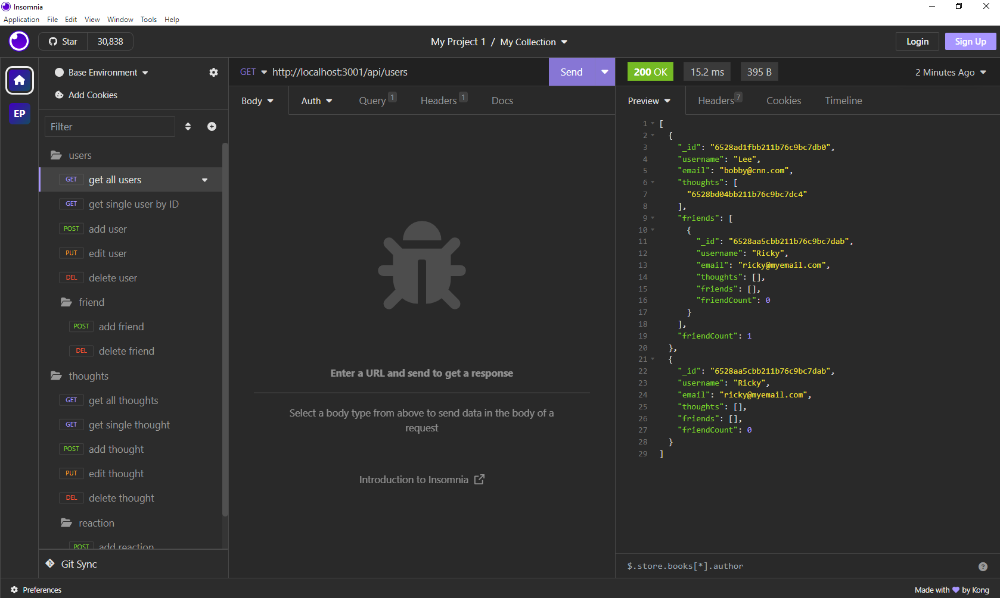

# NoSQL: Social Network API

## Table of Contents

- [Description](#description)
- [Technology](#technology)
- [Installation](#installation)
- [Usage](#usage)
- [License](#license)
- [Contribution](#contribution)
- [Questions](#questions)

## Description:

API for a social network web application where users can share their thoughts, react to friends’ thoughts, and create a friend list. You’ll use Express.js for routing, a MongoDB database, and the Mongoose ODM. In addition to using the Express.js and Mongoose, it also uses a JavaScript date library native JavaScript Date object to format timestamps.

## Technology:

Project is created with:


## Installation

To run this project, install it locally using npm:

```
npm install
```

## Usage

After installing npm packages, the application will be invoked by using the following command:

```
npm start
```

#### Walkthrough Video

[Click me to see the demo video!](https://drive.google.com/file/d/1FXiiydAKLNUMpM2rL116kyB9-FHf1SUS/view)

#### Insomnia Screenshot



## License

[](https://opensource.org/licenses/MIT) <br>
This project is licensed under MIT, for more information please visit [this website](https://opensource.org/licenses/MIT)

## Contribution

Made by Enrico Palermo

## Questions?

If you have any questions about the repo, open an issue or contact me directly at [enrico.palermo@ymail.com](mailto:enrico.palermo@ymail.com).


Check out my other projects at [epalermobootcamp](https://github.com/epalermobootcamp)
